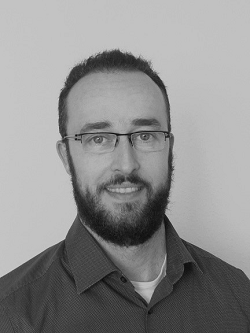

My resumee is structured into the following sections:
- [Projects and Work Experience](#projects-and-work-experience)
- [Education](#education) 
- [Expertise and Tools](#expertise-and-tools) 
- [Certified Qualifications](#certified-qualifications) 
- [Conferences and Presentations](#conferences-and-presentations) 
- [Awards and Promotions](#awards-and-promotions) 
- [Hobbies](#hobbies) 
- [Memberships](#memberships)

&nbsp;

## Projects and Work Experience

**08/2019 – today | Research Consultant (freelance / remote)**\
**Magnetic Resonance Systems Lab | Department of Imaging Physics | TU Delft**\
***Delft, Netherlands***
- Advice and support on machine-learning based active reduction of noise in MRI
- Advice and support on publishing in peer-reviewed journals
- Skills: Magnetic Resonance Imaging, Scientific Reading and Writing, Machine-Learning, Deep Learning
- Tools: Python, Jupyter, VSCode

**04/2022 – 06/2022 | Data Scientist (freelance / remote)**\
**mediaire GmbH (digital StartUp of the year 2021) | Digital Innovation in Radiology**\
***Berlin, Germany***
- Development of machine learning solutions for the detection of cerebral structural changes based on MRT image data
- Documentation of relevant scientific publications
- Skills: Magnetic Resonance Imaging, Scientific Reading, Machine-Learning
- Tools: Python, Jupyter, Google-Colab, VSCode, Gitlab, MITK-Workbench

**09/2017 – 09/2021 | Data Scientist (permanent / onsite)**\
**COUNT+CARE GmbH | Subsidariary of ENTEGA AG | Department for New Solutions**\
***Darmstadt, Germany***
- Teaching of data science basics at management level within the framework of a group-wide data competence center
- Advising the specialist departments of the ENTEGA Group on the translation of business probem into a data science use case
- Prototype development of machine learning models as part of feasibility studies based on tabular data sets and time series (e.g. churn score, customer value, customer segmentation, default score, predictive maintenance)
- Visualization and communication of data science results to the specialist departments and management
- Support for data engineers in integrating machine learning models into a productive environment
- Support in setting up a group-wide big-data platform
- Technical supervision of a working student as part of an AI-project
- Skills: Machine-Learning, Deep-Learning, Text-Mining, Timeseries Analysis
- Tools: Python, R, SPSS, SQL, Git, Microsoft Powerpoint

**06/2013 – 05/2017 | Research Group Leader | Postdoc (permanent / onsite)**\
**Insitute of Computer Assisted Clinical Medicince | University Medicince Mannheim | Heidelberg University**\
***Mannheim, Germany***
- Technical supervisor of 2-4 students at the same time in the context of doctoral, master's and bachelor's theses
- Obtaining third-party funds for the research project: "Quantification of tissue oxygenation and diffusion in the human brain using magnetic resonance imaging (MRI) for planning radiotherapy", funded with 63,000 € for the years 2015-2017 by the Junior Academy Medical Technology (German Research Foundation)
- Prototype development of robust MRI methods, e.g. combined with AI-based evaluation methods, to measure cerebral tissue oxygenation and diffusion for clinical use in cooperation with radiology
- Lecturer in physics, medicine, medical physics and medical engineering within lectures and seminars 
- Publication of research results in international journals and at research conferences
- Reviewer for various international research journals with special focus on Magnetic Resonance Imaging and signal- and imaging processing
- Skills: Medical Physics, Magnetic Resonance Imaging, Time-Series Analysis, Statistics, Image Processing, Signal Processing, Regression Methods, Scientific Reading and Writing
- Tools: Matlab, Microsoft Powerpoint, Microsoft Excel

[Top of Page](#projects-and-work-experience)

&nbsp;

## Education

**10/2008 – 06/2013 | Preparation of a Doctoral Thesis (grade: *"magna cum laude"*)**\
**Insitute of Computer Assisted Clinical Medicince | University Medicince Mannheim | Heidelberg University**\
***Mannheim, Germany***
- Prototype development of fast MRI imaging sequences in C++ to robustly measure neural activity in the human brain; Working title: "Functional magnetic resonance imaging with high spatial and temporal resolution, using EPI combined with various k-space undersampling techniques at 3 Tesla"
- Evaluation of complex fMRI studies in Matlab based on 3D-image data and time-series data
- Publication of research results in international journals and at research conferences
- Skills: Medical Physics, Magnetic Resonance Imaging, Time-Series Analysis, Statistics, Image Processing, Signal Processing, Regression Methods, Scientific Reading and Writing
- Tools: Matlab, Latex, Microsoft Powerpoint, Microsoft Excel

**07/2007 – 06/2008 | Preparation of a Diploma Thesis (grade: *"very good"*)**\
**German Cancer Research Center | Department of Medical Physics in Radiology | Heidelberg University**\
***Heidelberg, Germany***
- Working title: "Comparison of ASL and BOLD fMRI in a finger tapping experiment at 3T and development of an EPI measurement sequence with variable echo time"; 
- Tasks: Prototype development of MR imaging sequences in C++ to measure neuronal activity in the human brain; Implementation of image/signal analysis methods in Matlab
- Skills: Medical Physics, Magnetic Resonance Imaging, Time-Series Analysis, Statistics, Image Processing, Signal Processing, Regression Methods, Scientific Reading and Writing
- Tools: Matlab, C++, Latex, Microsoft Powerpoint, Microsoft Excel

**10/2001 – 06/2008 | Diploma in Physics**\
**University of Heidelberg**\
***Heidelberg, Germany***
- Majors: Experimental Physics, Theoretical Mechanics
- Minors: Mathematics, Computer Science
- Electives: Medical Physics

**10/2000 – 07/2001 | Civil Service**\
**Salesianum: Sponsorship of the Salesians of Don Bosco**\
***Munich, Germany***
- Supervision of trainees (e.g. tutoring in mathematics and physics or playing chess)
- Organization of sports events

**08/1997 – 06/1998 | Exchange Student - Stay Abroad**\
**South Cameron High-School**\
***Cameron - Louisiana, USA***
- Qualfication & participation in the Louisiana state mathematics competition
- Qualfication & participation in the Louisiana state championship in track & field

**09/1991 – 06/2000 | High-School**\
**Gymnasium Starnberg**\
***Starnberg, Germany***
- Abitur examination subjects: 
- mathematics (**grade: *“very good”***) 
- physics (**grade: *"good"***) 
- history (**grade: *"very good"***) 
- English (**grade: *"satisfactory"***)

[Top of Page](#projects-and-work-experience)

&nbsp;

## Expertise and Tools

**Expertise**
- Physics
- Medical Physics
- Magnetic Resonance Imaging
- Data Analysis
- Data Visualization
- Statistics
- Data Modeling (e.g. Machine Learning)
- Monte-Carlo Simulation
- Linear Optimization
- AB-Testing
- Image Processing
- Signal Processing
- Presentation / Publication of Scientific or Complex Issues
- Team / Agile Working (e.g. KANBAN) 

**Programming**
- Python (+++)
- R (++)
- Matlab (+++) 
- SQL (+)

**Tools**
- VSCode (+++)
- Jupyter (+++)
- RStudio (++)
- Google Colab (+++)
- Amazon Sagemaker Studio (++)
- Azure Machine Learning SDK (+++)
- Azure Cognitive Services API (+)
- SPSS-Modeller (++)
- Git (+)

**Linguistic Proficiency**
- German (C2, mother tongue)
- English (C1)

[Top of Page](#projects-and-work-experience)

&nbsp;

## Certified Qualifications

**2016 – 2017 | Certified Practitioner Data Science (15 ECTS; grade: *"very good"*)**\
**Bitkom Academy Certificate Course | Steinbeis University Berlin**\
***Berlin, Germany***
- Modules: data science fields and applications, data management & data governance, data acquisition & data access, data science algorithms, visualization & communication of analytical results
- Project working title: “Stockmarket Prediction Using Predictive Analytics”

**2015 – 2016 | Certified Advanced Training Courses from the University of Heidelberg**\
***Heidelberg, Germany***
- Course: "Fundamentals of Business Administration" (5 ECTS)
- Course: "Project Management" (2 ECTS)
- Course: "Management Consulting" (2 ECTS)

**2010 – 2013 | International Graduate Program *"Translational Neuroscience"* (120 ECTS) | Collaborative Research Center | German Research Foundation (SFB 636)**\
***Mannheim, Germany***
- Attending lectures, seminars, workshops on the topic of "Learning, memory, and brain plasticity: Implications for psychopathology"
- 01/2012 – 03/2012, Research Internship, Clinic for Addictive Behavior and Addiction Medicine, Central Institute for Mental Health: Tasks: Optimization of MR-sequences to measure the orbitofrontal cortex and implementation of statistical evaluation methods to detect neuronal activation

[Top of Page](#projects-and-work-experience)

&nbsp;

## Conferences and Presentations

### Meetings on Machine Learning and Artificial Intelligence
- 2021 - *Predictive Analytics World* (virtual visitor) - Berlin, Germany
- 2020 - *Mind Mastering Machines* (visitor) - Mannheim, Germany
- 2019 - *Predictive Analytics World* (visitor) - Berlin, Germany

### Meetings of the International Society for Magnetic Resonance in Medicine (*ISMRM*) and Biology (*ESMRMB*)
- 2016 - *ESMRMB* (speaker & poster presenter) - Vienna, Austria
- 2015 - *ESMRMB* (speaker & poster presenter) - Edinburgh, Scotland
- 2015 - *ISMRM* (poster presenter) - Toronto, Canada
- 2014 - *ISMRM* (poster presenter) - Milan, Italy
- 2012 - *ISMRM* (poster presenter) - Melbourne, Australia
- 2011 - *ISMRM* (poster presenter) - Montreal, Canada
- 2010 - *ISMRM* (poster presenter) - Stockholm, Sweden
- 2009 - *ESMRMB* (poster presenter) - Antalya, Turkey
- 2007 - *ISMRM* (speaker & poster presenter) - Wuerzburg, Germany

[Top of Page](#projects-and-work-experience)

&nbsp;

## Awards and Promotions
- 2014 - Dissertation prize, awarded 10,000 € by the *Thomas Gessmann Foundation* for the engineering department
- 2011/2012 - Doctoral scholarship, funded by the *Collaborative Research Center (SFB 636)* of the German Research Foundation

[Top of Page](#projects-and-work-experience)

&nbsp;

## Hobbies
- Physics, Science, Artifical Intelligence 
- Hiking, fitness, model plane aerobatics, skiing, windsurfing
- Athletics (greatest successes: 2003, German university champion (4x400m relay); 2002, Baden vice champion (400m); 2000/2001, Bavarian junior champion (400m/800m)

[Top of Page](#projects-and-work-experience)

&nbsp;

## Memberships
- German Physical Society 
- SOS Children's Village

[Top of Page](#projects-and-work-experience)