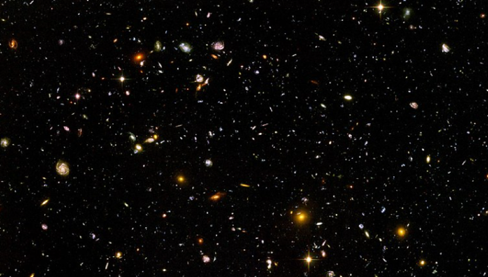

\
*Image Credit: Wikipedia*

*“It doesn't matter how beautiful your theory is, it doesn't matter how smart you are. If it doesn't agree with experiment, it's wrong.” ― Richard P. Feynman ―*

## My Professional Background
I have 6 years of professional experience in applying state-of-the-art machine learning and deep learning algorithms to the fields of marketing analytics, healthcare and natural language processing. My work includes developing and validating machine-learning models for use cases such as customer value prediction, customer segmentation, churn prediction, disease prediction, and AI-based SEO-content generation. I consulted various specialist departments on translating business problems into well-defined data science use cases, as well as supporting machine learning engineers and software developers with the deployment and monitoring of models. Additionally, I bring 10 years of research experience in medical physics, medical imaging, signal processing, mathematics, statistics, and regression analysis from my past work as an academic researcher.

## My Vision and Future Goals
I am a highly motivated physicist and data scientist driven to discover and apply innovative solutions to complex problems. I am passionate about living in the era of the Industrial Revolution 4.0 and leveraging my academic research background and practical knowledge in the fields of data science and artificial intelligence to actively contribute to the digital transformation. I am committed to continuously developing my skills in these areas, ensuring I am always at the forefront of technology. With my ambition and enthusiasm, I am confident I can make a positive impact on any organization I join.

