In the following, you´ll find an overview of my [data science projects](#data-science-projects) working in industry. Then you´ll find some [research projects on machine learning](#research-projects-on-machine-learning) working in academia. For the matter of completeness I appended some [side-hustle projects](#side-hustle-projects) I implemented in my spare time just for fun, curiosity or my eagerness to expand my knowledge in the field of machine learning and optimization.

# **Data Science Projects**

### **Natural Language Processing Project:**

| **Use Case** | **Project Goal** | **my Role** | **Skills & Tools** |
| ----------- | ----------- | ----------- | ----------- |
| ***AI Data App - SEO Content Creation using ChatGPT***  | *To implement a web-app for the generation of SEO content using ChatGPT* | *I implemented a web-app to generate search-engine optimized (SEO) content.* | *Python (numpy, pandas, spacy, nltk, googlesearch, openai, docs, requests, re), Jupyter, VSCode, streamlit* |

[Top of Page](#data-science-projects)

### **Healthcare Project:**

| **Use Case** | **Project Goal** | **my Role** | **Skills & Tools** |
| ----------- | ----------- | ----------- | ----------- |
| ***Cerebral Disease Detection*** 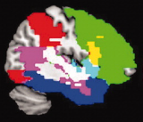 | *To identity pathological cerebral changes* | *I developed explainable classification ml-models providing disease propensity scores based on labeled MRI volumetry datasets. In addition, I documented relevant scientific publications on this topic.* | *Magnetic Resonance Imaging, Image Analysis, Machine Learning, Data Preparation, Data Visualization, Explainable AI (shapley values), Python (numpy, pandas, sklearn, matplotlib, shap), Jupyter, Colab, VSCode, Gitlab* |

[Top of Page](#data-science-projects)

### **Marketing Analytics Projects:**

| **Use Case** | **Project Goal** | **my Role** | **Skills & Tools** |
| ----------- | ----------- | ----------- | ----------- |
| ***Customer Value Prediction*** | *To improve customer value estimation* | *I consulted the specialist department on how to improve an existing customer value model applying state-of-the-art machine learning methods. I further supported the data engineering team to continuously deploy new model versions.* | *Machine Learning, Data Preparation, Data Visualization, SPSS Modeler* |
| **Use Case** | **Project Goal** | **my Role** | **Skills & Tools** |
| ***Customer Churn Prediction*** | *To improve customer churn prediction* | *I consulted the specialist department on how to improve the existing customer churn model applying state-of-the-art machine learning methods. I further supported the data engineering team to continuously deploy new model versions.* | *Machine Learning, Data Preparation, Data Visualization, SPSS Modeler* |
| **Use Case** | **Project Goal** | **my Role** | **Skills & Tools** |
| ***Customer Segmentation*** | *To improve customer segmentation* | *I developed a new customer segmentation model with improved performance compared to the existing model. I further supported the data engineering team to continuously deploy new model versions.* | *Machine Learning, Data Preparation, Data Visualization, SPSS Modeler* |
| **Use Case** | **Project Goal** | **my Role** | **Skills & Tools** |
| ***Conversion Rate Optimization*** | *To improve conversion rates* | *I developed a classification model based on tabular data providing propensity scores for conversion that could be used for priorization purposes. In addition, I advised the specialist department on the benefits and pitfalls during use of the model.* | *Machine Learning, Data Preparation, Data Visualization, Python (numpy, pandas, matplotlib, sklearn), Jupyter* |
| **Use Case** | **Project Goal** | **my Role** | **Skills & Tools** |
| ***Price Optimization*** | *To optimize product prices* | *I developed a classification model based on tabular data as a foundation for further product price optimization. In addition, I advised the specialist department on the benefits and pitfalls during use of the model.* | *Machine Learning, Data Preparation, Data Visualization, Python (numpy, pandas, matplotlib, sklearn, spacy), Jupyter, SPSS modeler* |
| **Use Case** | **Project Goal** | **my Role** | **Skills & Tools** |
| ***Data Deduplication*** | *To remove duplicated rows from large datasets* | *I developed a classification-clustering mixture model based on tabular data to detect duplicates of names and addresses. In addition, I supported the development team with building data-pipelines and the deployment of the model.* | *Machine Learning, Data Preparation, Data Visualization, Python (numpy, pandas, matplotlib, sklearn, dedupe), Jupyter, VSCode, git, SQL* |
| **Use Case** | **Project Goal** | **my Role** | **Skills & Tools** |
| ***Purchase Analysis*** | *To identity incorrect order processes* | *I developed a classification model from historical tabular data providing propensity scores for incorrect orders. I deployed and updated the model in SPSS modeler. In addition, I advised the specialist department on the benefits and pitfalls during use of the model.* | *Machine Learning, Data Preparation, Data Visualization, Natural Language Processing (bag-of-words), Python (numpy, pandas, sklearn, matplotlib), R, Jupyter, RStudio, Spyder, SPSS Modeler* |

[Top of Page](#data-science-projects)

### **Finance Project:**

| **Use Case** | **Project Goal** | **my Role** | **Skills & Tools** |
| ----------- | ----------- | ----------- | ----------- |
| ***Credit Default*** | *To predict upcoming payment defaults* | *I developed a classification model based on tabular time-series data providing the propensity scores of upcoming payment defaults. In addition, I advised the specialist department on the benefits and pitfalls during use of the model.* | *Machine Learning, Deep Learning, Data Preparation, Data Visualization, Python (numpy, pandas, matplotlib, sklearn, keras), Jupyter, VSCode* |

[Top of Page](#data-science-projects)

### **Time Series Forecasting Projects:**

| **Use Case** | **Project Goal** | **my Role** | **Skills & Tools** |
| ----------- | ----------- | ----------- | ----------- |
| ***Predictive Maintenance*** 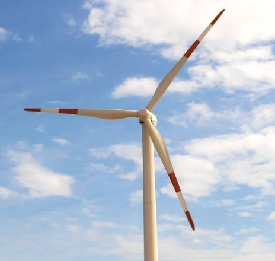| *To predict machine-failure of wind turbines* | *I developed a classification model based on weather and sensory time-series data providing propensity scores for imminent failure of wind turbines. In addition, I advised the specialist department on the benefits and pitfalls during use of the model.* | *Machine Learning, Data Preparation, Data Visualization, SPSS Modeler* |
| **Use Case** | **Project Goal** | **my Role** | **Skills & Tools** |
| ***Price Forecasting*** | *To predict electricity market prices* | *I developed a regression model based on historical time-series data to estimate the electricity market price for the next day. In addition, I advised the specialist department on the benefits and pitfalls during use of the model.* | *Machine Learning, Deep-Learning, Data Preparation, Data Visualization, Python (numpy, pandas, matplotlib, sklearn, keras), Jupyter, VSCode* |
| **Use Case** | **Project Goal** | **my Role** | **Skills & Tools** |
| ***Meter Forecasting*** 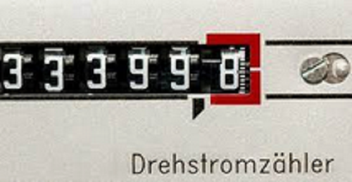| *To forecast meter-readings* | *I developed a regression model based on historical time-series data to forecast meter-readings. In addition, I advised the specialist department on the benefits and pitfalls during use of the model.* | *Machine Learning, Deep-Learning, Data Preparation, Data Visualization, Python (numpy, pandas, matplotlib, sklearn, keras), Jupyter, VSCode* |

[Top of Page](#data-science-projects)

&nbsp;

# **Research Projects on Machine Learning**

| **Use Case** | **Project Goal** | **my Role** | **Skills & Tools** |
| ----------- | ----------- | ----------- | ----------- |
| ***MRI-based OEF Mapping*** 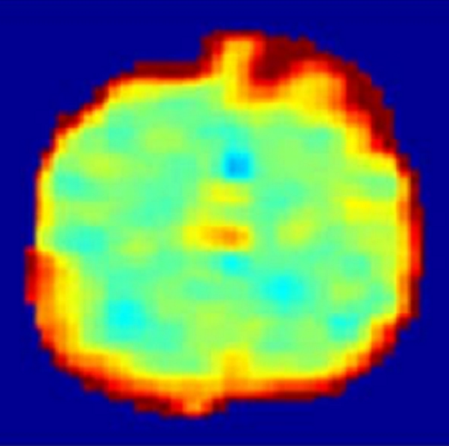 | *To improving mapping of the OEF (=oxygen extraction fraction) with artificlial neural networks* | *I developed an artificial neural network regression model to improve the quality of OEF maps, very important for assessing tissue vitality, tumor diagnosis or planing radio therapy. (More details are provided in: Domsch et al., Magnetic Resonance in Medicine, 79(2), pp.890-899, 2018)* | *Magnetic Resonance Imaging, Machine Learning, Artificial Neural Networks, Matlab* |
| ***MRI-based OEF Mapping*** 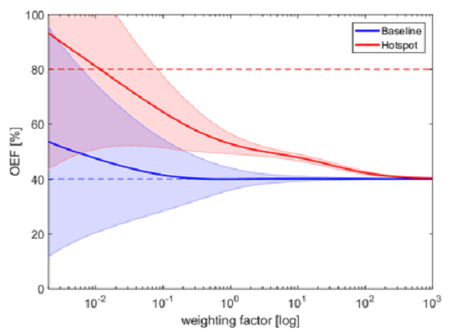 | *To improve mapping of the OEF (=oxygen extraction fraction) with regularized regression* | *I developed a regularized regression model to improve the quality of OEF maps, very important for assessing tissue vitality, tumor diagnosis or planing radio therapy. Further, I advised other colleagues on the development of this data modeling strategy. (More details are provided in: Domsch et al., Proc. ESMRMB Congress, Edinburgh, UK, 32, p.36, 2015); S. Thomas, S. Hubertus, S. Domsch and L. Schad, Proc. Int. Soc. Magn. Reson. Med., Paris, France, 26, p.2093, 2018* | *Magnetic Resonance Imaging, Machine Learning, Artificial Neural Networks, Matlab* |
| **Use Case** | **Project Goal** | **my Role** | **Skills & Tools** |
| ***MRI-based Diffusion Imaging*** 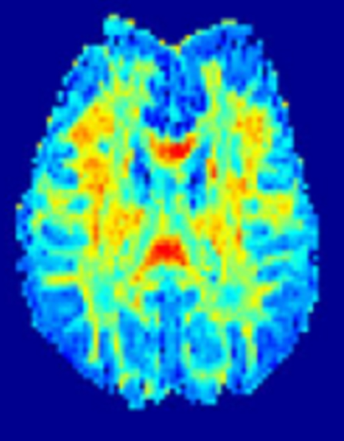 | *To research on improving the mapping of diffusion parameters with artificlial neural networks* | *I advised other colleagues on the development of an artificial neural network regression model to improve the quality of diffusion parameter maps, very important for assessing tissue vitality, tumor diagnosis or planing radio therapy. (More details are provided in: Domsch and Bertleff et al., NMR Biomed, 30(12), 2017)* | *Magnetic Resonance Imaging, Machine Learning, Artificial Neural Networks, Matlab* |

[Top of Page](#data-science-projects)

&nbsp;

# **Side-Hustle Projects**

Below you find a brief overview of some sample projects in the field of machine learning, natural language processing and optimization which I implemented in my spare time just for fun, curiosity or my eagerness to expand my knowlede in the field of machine learning and optimization. Please check out my [github](https://github.com/Sebastian1981/) and [docker-hub](https://hub.docker.com/u/63531981) for more interesting data science projects and ai data apps.

[Top of Page](#data-science-projects)

&nbsp;

## **Operations Research:**

| **Use Case** | **Project Goal** | **Implementation** | **Skills & Tools** |
| ----------- | ----------- | ----------- | ----------- |
| ***AI Data App - Supply-Chain Optimization*** 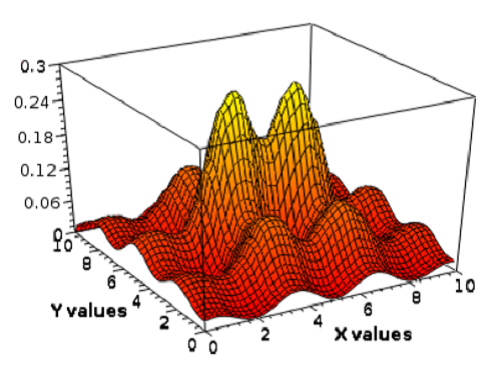 | *To implement a supply-chain optimization web-app* | *I implemented a  supply-chain app to minimize the production costs by optimizing the production site locations and the respective quantities produced. The supply-chain was modeled using mixed-integer linear programming (MILP). Based on MILP combined with Monte-Carlo simulations, distributions were calculated for the production costs, the slack and the shadow prices and the production sites and their respective quantities. The app is deployed on [dockerhub](https://hub.docker.com/repository/docker/63531981/supply_chain_app) and in the [streamlit-community-cloud](https://operationsresearch.streamlitapp.com). (More details are provided in my [github](https://github.com/Sebastian1981/Operations_Research))* | *Mixed-Integer Linear Programming, Monte-Carlo Simulation, Python (numpy, pandas, matplotlib, PuLP), Jupyter, VSCode, streamlit, docker* |

[Top of Page](#data-science-projects)

&nbsp;

## **Finance:**

| **Use Case** | **Project Goal** | **Implementation** | **Skills & Tools** |
| ----------- | ----------- | ----------- | ----------- |
| ***AI Data App - Asset-Portfolio Optimization*** 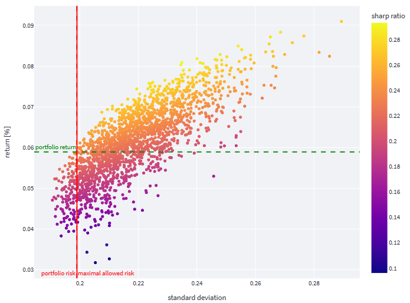 | *To implement a portfolio optimization web-app* | *I implemented a  finance portfolio optimization app to maximize the expected return for a given risk using monte-carlo simulations, genetic algorithms and artificial swarm intelligence. The app is deployed on [dockerhub](https://hub.docker.com/repository/docker/63531981/portfolio_optimize). (More details are provided in my [github](https://github.com/Sebastian1981/Stock_Prediction))* | *Monte-Carlo Simulation, Machine Learning, Genetic Algorithms, Artificial Swarm Intelligence, Python (numpy, pandas, matplotlib, sklearn, shap, geneticalgorithm, pyswarm), Jupyter, VSCode, streamlit, docker, dockerhub* |

| **Use Case** | **Project Goal** | **Implementation** | **Skills & Tools** |
| ----------- | ----------- | ----------- | ----------- |
| ***AI Data App - Insurance Bill Prediction***  | *To implement both a web-app and web-api to predict insurance bills* | *I implemented a regression model to predict insurance bills based on user input. The app is deployed on [dockerhub](https://hub.docker.com/repository/docker/63531981/insurance_app). (More details are provided in my [github](https://github.com/Sebastian1981/Insurance_Bill_Prediction))* | *Machine Learning, Python (numpy, pandas, matplotlib, sklearn, flask-api), Jupyter, VSCode, streamlit, docker, dockerhub* |

| **Use Case** | **Project Goal** | **Implementation** | **Skills & Tools** |
| ----------- | ----------- | ----------- | ----------- |
| ***AI Data App - Credit Default Prediction***  <small><small>*Image courtesy: kindpng.com*</small> | *To implement a credit default prediction web-app* | *I implemented a classification model to predict credit default risks. The app is deployed on [dockerhub](https://hub.docker.com/repository/docker/63531981/credit_app). (More details are provided in my [github](https://github.com/Sebastian1981/CustomerAnalytics_CreditDefaultPrediction))* | *Machine Learning, Python (numpy, pandas, matplotlib, sklearn, shap), Jupyter, VSCode, streamlit, docker, dockerhub, azure app service* |

[Top of Page](#data-science-projects)

&nbsp;

## **Natural Language Processing:**

| **Use Case** | **Project Goal** | **Implementation** | **Skills & Tools** |
| ----------- | ----------- | ----------- | ----------- |
| ***NLP - Text Recognition*** 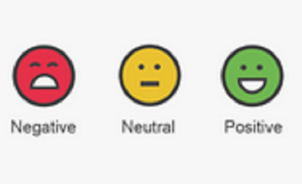 <small><small>*Image courtesy: thedatascientist.com*</small>  | *To implement a text recognizer in Azure* | *I implemented a language recognition model, trained on raw text, using Azure cognitive services to identify language, extract keywords and entities and analyse sentiments from hotel reviews. (The code and more details are provided in the [github repo](https://github.com/Sebastian1981/Text_Analysis))* | *Natural Language Processing, Machine Learning, Data Preparation, Python (numpy, pandas, sklearn, matplotlib), VSCode, Jupyter Notebook, Azure Cognitive Services* |

[Top of Page](#data-science-projects)

&nbsp;

## **Healthcare:**

| **Use Case** | **Project Goal** | **Implementation** | **Skills & Tools** |
| ----------- | ----------- | ----------- | ----------- |
| ***AI Data App - COVID-19 Prediction*** 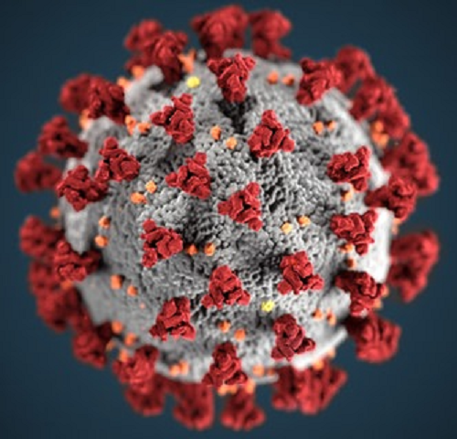 <small><small>*Image courtesy: ndr.de*</small> | *To implement a web-app for predicting COVID-19 patients in ICU* | *I implemented a time-series regression model on public covid datasets, provided by www.ourworldindata.org, to predict the number of COVID-19 patients in ICU (=intensive care units) for different countries worldwide in real-time. Then I developed a streamlit app. The app is deployed on [dockerhub](https://hub.docker.com/repository/docker/63531981/covid_app). (More details are provided in my [github](https://github.com/Sebastian1981/covid_prediction))* | *Auto-ML, Python (numpy, pandas, matplotlib, pycaret), Jupyter, VSCode, streamlit, docker, dockerhub* |

[Top of Page](#data-science-projects)

&nbsp;

## **Image Analysis:**

| **Use Case** | **Project Goal** | **Implementation** | **Skills & Tools** |
| ----------- | ----------- | ----------- | ----------- |
| ***Object Detection*** 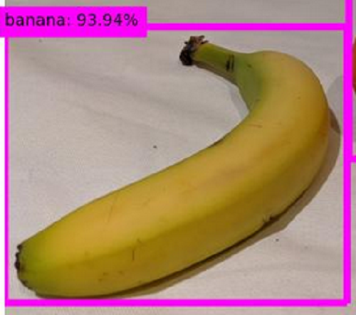 | *To implement a fruit detector in Azure* | *I implemented a fruit detection model, trained on image data, using Azure cognitive services. (The code and more details are provided in the [github repo](https://github.com/Sebastian1981/Object_Detection))* | *Image Processing, Machine Learning, Data Preparation, Data Visualization, Python (numpy, pandas, sklearn, matplotlib, pil), VSCode, Jupyter, Azure Cognitive Services* |

[Top of Page](#data-science-projects)