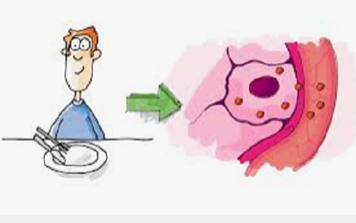

In the following, I provide an overview of the projects related to machine-learning, deep-learning or data science in general. They will be subdivided into three group, which are the projects I carried out as a data science professional, the projects I carried out as an academic researcher and those I carried out due to personal interests.

&nbsp;

## **My Projects on Machine-Learning as a Data-Science Professional:**

| **Use Case** | **Project Goal** | **my Role** | **Skills & Tools** |
| ----------- | ----------- | ----------- | ----------- |
| **Disease Detection Model**  | **Show feasibility to identity pathological cerebral changes using a machine learning approach** | *I developed explainable classification models providing disease propensity scores based on labeled MRI volumetry datasets. The proof-of-concept study also included data preparation, data visualization and model performance evaluation and model optimization. In addition, I documented relevant scientific publications. Finally, I handed over the project repository in a well-developed and documented state to the machine learning engineering team.* | **Magnetic Resonance Imaging, Image Analysis, Machine Learning, Data Preparation, Data Visualization, Explainable AI (shapley values), Python (numpy, pandas, sklearn, matplotlib, shap), Jupter Notebook, Google-Colab, VSCode, Gitlab** |
| **Use Case** | **Project Goal** | **my Role** | **Skills & Tools** |
| **Purchase Analysis Model** | **Show feasibility to identity incorrect order processes applying machine learning** | *I developed a classification model providing propensity scores for incorrect orders based on labeled tabular datasets. I further prepared the data, visualized the data and evaluated and optimized the model performance. I deployed the model in SPSS modeler.* | **Machine Learning, Data Preparation, Data Visualization, Natural Language Processing (bag-of-words), Python (numpy, pandas, sklearn, matplotlib), R, Jupter Notebook, RStudio, Spyder, SPSS Modeler** |
| **Use Case** | **Project Goal** | **my Role** | **Skills & Tools** |
| **Machine-Failure Forecast Model** | **Show feasibility to predict machine failure of wind turbines applying machine learning** | *I developed a classification model providing propensity scores for imminent failure of wind turbines based on weather and sensory time-series data. I further prepared the data, visualized the data and evaluated and optimized the model performance. I also supported the specialist department in an advisory capacity in evaluating the benefit of the model in the event of potential productive use.* | **Machine Learning, Data Preparation, Data Visualization, SPSS Modeler** |
| **Use Case** | **Project Goal** | **my Role** | **Skills & Tools** |
| **Credit Default Forecast Model** | **Show feasibility to predict upcoming payment defaults applying machine learning** | *I developed a classification model providing the propensity scores of upcoming payment defaults based on labeled historical time-series data. I further prepared the data, visualized the data and evaluated and optimized the model performance. I also supported the specialist department in an advisory capacity in evaluating the benefit of the model in the event of potential productive use.* | **Machine Learning, Deep Learning, Data Preparation, Data Visualization, Python (numpy, pandas, matplotlib, sklearn, keras), Jupter Notebook, VSCode** |
| **Use Case** | **Project Goal** | **my Role** | **Skills & Tools** |
| **Data Deduplication Model** | **Show feasibility to remove duplicate names and addresses from large datasets applying machine learning** | *I developed a classification-clustering mixture model to detect and remove duplicates of names and addresses based on labeled tabular datasets. I further prepared the data, visualized the data and evaluated and optimized the model performance. I also supported the specialist department in an advisory capacity in evaluating the benefit of the model in the event of potential productive use. I also supported the data engineering and software development team with the deployment of the model.* | **Machine Learning, Data Preparation, Data Visualization, Python (numpy, pandas, matplotlib, sklearn, dedupe), Jupter Notebook, VSCode, git, SQL** |
| **Use Case** | **Project Goal** | **my Role** | **Skills & Tools** |
| **Customer Value Model** | **Improve customer value model & deployment** | *I consulted the specialist department on how to improve the existing customer value model applying state-of-the-art machine learning methods. I further supported the data engineering team to continuously deploy new model versions.* | **Consulting on Machine Learning, SPSS Modeler, SQL** |
| **Use Case** | **Project Goal** | **my Role** | **Skills & Tools** |
| **Customer Churn Model** | **Improve customer churn model & deployment** | *I consulted the specialist department on how to improve the existing customer churn model applying state-of-the-art machine learning methods. I further supported the data engineering team to continuously deploy new model versions.* | **Consulting on Machine Learning, SPSS Modeler, SQL** |
| **Use Case** | **Project Goal** | **my Role** | **Skills & Tools** |
| **Customer Segmentation Model** | **Improve customer segmentation model & deployment** | *I improved the performance of an existing customers segmentation model applying state-of-the-art machine learning methods. I further supported the data engineering team to continuously deploy new model versions.* | **Consulting on Machine Learning, SPSS Modeler, SQL** |
| **Use Case** | **Project Goal** | **my Role** | **Skills & Tools** |
| **Deal Completion Rate Optimization** | **Show feasibility to maximize the likelihood of business deal-completion with machine learning** | *I developed a classification model providing the propensity scores of business deals based on labeled tabular datasets. I further prepared the data, visualized the data and evaluated and optimized the model performance. I also supported the specialist department in an advisory capacity in evaluating the benefit of the model in the event of potential productive use.* | **Machine Learning, Data Preparation, Data Visualization, Python (numpy, pandas, matplotlib, sklearn), Jupter Notebook** |
| **Use Case** | **Project Goal** | **my Role** | **Skills & Tools** |
| **Pricing Optimization** | **Show feasibility to estimate the optimal product price with machine learning** | *I developed a classification-regression mixture model to find the optimal product prices based on labeled tabular datasets. I further prepared the data, visualized the data and evaluated and optimized the model performance. I also supported the specialist department in an advisory capacity in evaluating the benefit of the model in the event of potential productive use and how to iteratively improve the model.* | **Machine Learning, Data Preparation, Data Visualization, Python (numpy, pandas, matplotlib, sklearn, spacy), Jupter Notebook, SPSS modeler** |
| **Use Case** | **Project Goal** | **my Role** | **Skills & Tools** |
| **Electricity Price Forecast Model** | **Show feasibility to predict daily electricity market prices with machine learning** | *I developed a regression model to estimate the electricity market price for the next day based on historical time-series data. I further prepared the data, visualized the data and evaluated and optimized the model performance. I also supported the specialist department in an advisory capacity in evaluating the benefit of the model in the event of potential productive use.* | **Machine Learning, Deep-Learning (RNN model), Data Preparation, Data Visualization, Python (numpy, pandas, matplotlib, sklearn, keras), Jupter Notebook, VSCode** |
| **Use Case** | **Project Goal** | **my Role** | **Skills & Tools** |
| **Meter-Reading Forecast Model** | **Show feasibility to forecast meter-readings with machine learning** | *I developed a regression model to forecast meter-readings based on historical time-series data. I further prepared the data, visualized the data and evaluated and optimized the model performance. I also supported the specialist department in an advisory capacity in evaluating the benefit of the model in the event of potential productive use.* | **Machine Learning, Deep-Learning (RNN model), Data Preparation, Data Visualization, Python (numpy, pandas, matplotlib, sklearn, keras), Jupter Notebook, VSCode** |

&nbsp;

## **My Projects on Machine-Learning as an Academic Researcher:**

| **Use Case** | **Project Goal** | **Implementation** | **Skills & Tools** |
| ----------- | ----------- | ----------- | ----------- |
| **Medical-Imaging**  | **Estimate voxel-wise oxygen extraction fraction (OEF) using an artifical neural network** | *An artificial neural network regression model was developed with the input being the GESSE-BOLD signal and multiple outputs with one being the oxygen extraction fraction, which is an important parameter for tissue vitality. Compared to normal least-squares fitting, the oef-maps were clearly improved. (More details are provided in: Domsch et al., Magnetic Resonance in Medicine, 79(2), pp.890-899, 2018)* | **Magnetic Resonance Imaging, Machine Learning, Artificial Neural Networks, Matlab** |
| **Use Case** | **Project Goal** | **Implementation** | **Skills & Tools** |
| **Medical-Imaging**  | **Estimate voxel-wise diffusion parameters using an artifical neural network** | *An artificial neural network regression model was developed with the input being diffusion-weighted MR images and with multiple outputs being important diffusion parameters reflecting tissue vitality. Compared to normal least-squares regression fitting, the diffusion parameter maps were clearly improved. (More details are provided in: Domsch et al., NMR Biomed, 30(12), 2017)* | **Magnetic Resonance Imaging, Machine Learning, Artificial Neural Networks, Matlab** |

&nbsp;

## **My Personal-Interest Projects on Machine-Learning:**

| **Use Case** | **Project Goal** | **Implementation** | **Skills & Tools** |
| ----------- | ----------- | ----------- | ----------- |
| **Cardio-Vascular Disease Model**  <small><small>*Image courtesy: guardian.ng*</small> | **Implement and deploy cardiovascular disease model in AWS-Sagemaker** | *I developed a classification model providing disease propensity scores based on labeled data. The proof-of-concept study also included data preparation, data visualization and model performance evaluation and model optimization. The model is deployed as an endpoint in aws-sagemaker. (The code and more details are provided in my github.)* | **Machine Learning, Data Preparation, Data Visualization, Python (numpy, pandas, sklearn, matplotlib, seaborn, sagemaker, boto3), AWS-Sagemaker** |
| **Use Case** | **Project Goal** | **Implementation** | **Skills & Tools** |
| **Topic Modeling API**  | **Implement and deploy a topic extraction model in flask-api** | *I developed a natural language based on the latent-dirichlet-allocation algorithm to extract topics for given articles. The training data contains over 1.000 different english articles covering various topics. Since topic modeling is an unsupervised-learning task, the ground-truth about the actual topics is unknown. However, checking the proposed topics shows high plausibility. Finally I deployed the model using a flask-api. (The code and more details are provided in my github.)* | **Natural Language Processing, Machine Learning, Data Preparation, Data Visualization, Python (numpy, pandas, sklearn, matplotlib, nltk, flask), VSCode, Jupyter Notebook** |
| **Use Case** | **Project Goal** | **Implementation** | **Skills & Tools** |
| **Object Detection**  | **Implement object detection model using Azure Cognitive Services** | *I trained a fruit detection model applying Azure´s cognitive services. Training the model was carried out with as little as 33 images showing different fruits. The model´s performance with an overall recall of 93% and precision of 100% was quite astonishing. The reason behind is that a pre-trained model was used. (The code and more details are provided in my github.)* | **Image Processing, Machine Learning, Data Preparation, Data Visualization, Python (numpy, pandas, sklearn, matplotlib, pil), VSCode, Jupyter Notebook, Azure Cognitive Services** |
| **Use Case** | **Project Goal** | **Implementation** | **Skills & Tools** |
| **Text Analysis**  <small><small>*Image courtesy: thedatascientist.com*</small>  | **Implement a language recognition model using Azure Cognitive Services** | *I trained a language recognition model to identify languages, extract keywords and entities and analyse sentiments from hotel reviews using Azure´s cognitive services. I trained a pre-trained language model with as little as five reviews. However, this was sufficient to achieve very good performance. (The code and more details are provided in my github.)* | **Natural Language Processing, Machine Learning, Data Preparation, Python (numpy, pandas, sklearn, matplotlib), VSCode, Jupyter Notebook, Azure Cognitive Services** |
| **Use Case** | **Project Goal** | **Implementation** | **Skills & Tools** |
| **Credit Default Prediction App**  <small><small>*Image courtesy: kindpng.com*</small> | **Implement and deploy a credit default risk model in a streamlit app and docker** | *First, I trained, tuned and evaluated a classification model on public data to predict customers` credit default risks. Then I deployed the best-performing model using a streamlit app running in docker. The app allows the user to explore the dataset, train and validate the model and to visualize single model decisions based on shapley values (explainable AI). (The code and more details are provided in my github.)* | **Machine Learning, Data Preparation, Python (numpy, pandas, matplotlib, sklearn, streamlit, docker), VSCode, Jupyter** |
| **Use Case** | **Project Goal** | **Implementation** | **Skills & Tools** |
| **Diabetis-Risk Prediction API**  <small><small>*Image courtesy: aok-erleben.de*</small> | **Implement and deploy a diabetis-risk model in flask-api and docker** | *First, I trained a few classification models on public data to predict diabetis risks. Thereby, the model with the best performance was identified applying a custom scoring function in order to meet business requirements (e.g. a false negative prediction leads to higher costs than a false positive prediction). Moreover, aspects of responsible AI such as model explainability and also model fairness were analyzed. I deployed the best-performing model using a flask-api running in docker. (The code and more details are provided in my github.)* | **Explainable AI, Fair AI, Machine Learning, Data Preparation, Data Visualization, Python (numpy, pandas, matplotlib, sklearn, shap, fair-learn, docker), VSCode, Jupyter** |
| **Use Case** | **Project Goal** | **Implementation** | **Skills & Tools** |
| **Churn Prediction API**  | **Implement and deploy a churn risk model in fast-api and docker using auto-ml** | *First, I trained a few classification models on public data to predict individual churn risks. Thereby, the model with the best performance was identified applying a custom scoring function in order to meet business requirements (e.g. a false negative prediction leads to higher costs than a false positive prediction). Moreover, aspects of responsible AI such as model explainability and also model fairness were analyzed. I deployed the best performing model using a flask-api running in docker. (The code and more details are provided in my github.)* | **Automated Machine-Learning, Explainable AI, Fair AI, Data Preparation, Data Visualization, Python (numpy, pandas, pycaret, fastapi, docker), VSCode, Jupyter** |

