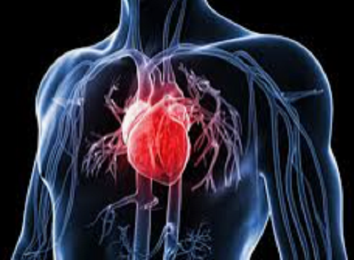
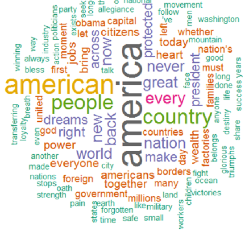

In the following, I provide an overview of the relevant data science projects I conducted throughout the years. They will be subdivided into the projects I carried out as a data science professional and those I carried out due to my personal interests. Any machine learning or deep learning projects I conducted as a researcher in academia are not listed here focusing more on projects more relevant to industry related topics.

## **Projects as a Data Science Professional:**

| **Use Case** | **Project Goal** | **my Role** | **Skills & Tools** |
| ----------- | ----------- | ----------- | ----------- |
| **Disease Detection Model**  | *Show feasibility to identity pathological cerebral changes using a machine learning approach* | *I developed explainable classification models providing disease propensity scores based on labeled MRI volumetry datasets. The proof-of-concept study also included data preparation, data visualization and model performance evaluation and model optimization. In addition, I documented relevant scientific publications. Finally, I handed over the project repository in a well-developed and documented state to the machine learning engineering team.* | Magnetic Resonance Imaging, Image Analysis, Machine Learning, Data Preparation, Data Visualization, Explainable AI (shapley values), Python (numpy, pandas, sklearn, matplotlib, shap), Jupter Notebook, Google-Colab, VSCode, Gitlab |
| **Use Case** | **Project Goal** | **my Role** | **Skills & Tools** |
| **Purchase Analysis Model** | *Show feasibility to identity incorrect order processes applying machine learning* | *I developed a classification model providing propensity scores for incorrect orders based on labeled tabular datasets. I further prepared the data, visualized the data and evaluated and optimized the model performance. I deployed the model in SPSS modeler.* | Machine Learning, Data Preparation, Data Visualization, Natural Language Processing (bag-of-words), Python (numpy, pandas, sklearn, matplotlib), R, Jupter Notebook, RStudio, Spyder, SPSS Modeler |
| **Use Case** | **Project Goal** | **my Role** | **Skills & Tools** |
| **Machine-Failure Forecast Model** | *Show feasibility to predict machine failure of wind turbines applying machine learning* | *I developed a classification model providing propensity scores for imminent failure of wind turbines based on weather and sensory time-series data. I further prepared the data, visualized the data and evaluated and optimized the model performance. I also supported the specialist department in an advisory capacity in evaluating the benefit of the model in the event of potential productive use.* | Machine Learning, Data Preparation, Data Visualization, SPSS Modeler |
| **Use Case** | **Project Goal** | **my Role** | **Skills & Tools** |
| **Credit Default Forecast Model** | *Show feasibility to predict upcoming payment defaults applying machine learning* | *I developed a classification model providing the propensity scores of upcoming payment defaults based on labeled historical time-series data. I further prepared the data, visualized the data and evaluated and optimized the model performance. I also supported the specialist department in an advisory capacity in evaluating the benefit of the model in the event of potential productive use.* | Machine Learning, Deep Learning, Data Preparation, Data Visualization, Python (numpy, pandas, matplotlib, sklearn, keras), Jupter Notebook, VSCode |
| **Use Case** | **Project Goal** | **my Role** | **Skills & Tools** |
| **Data Deduplication Model** | *Show feasibility to remove duplicate names and addresses from large datasets applying machine learning* | *I developed a classification-clustering mixture model to detect and remove duplicates of names and addresses based on labeled tabular datasets. I further prepared the data, visualized the data and evaluated and optimized the model performance. I also supported the specialist department in an advisory capacity in evaluating the benefit of the model in the event of potential productive use. I also supported the data engineering and software development team with the deployment of the model.* | Machine Learning, Data Preparation, Data Visualization, Python (numpy, pandas, matplotlib, sklearn, dedupe), Jupter Notebook, VSCode, git, SQL |
| **Use Case** | **Project Goal** | **my Role** | **Skills & Tools** |
| **Customer Value Model** | *Improve customer value model & deployment* | *I consulted the specialist department on how to improve the existing customer value model applying state-of-the-art machine learning methods. I further supported the data engineering team to continuously deploy new model versions.* | Consulting on Machine Learning, SPSS Modeler, SQL |
| **Use Case** | **Project Goal** | **my Role** | **Skills & Tools** |
| **Customer Churn Model** | *Improve customer churn model & deployment* | *I consulted the specialist department on how to improve the existing customer churn model applying state-of-the-art machine learning methods. I further supported the data engineering team to continuously deploy new model versions.* | Consulting on Machine Learning, SPSS Modeler, SQL |
| **Use Case** | **Project Goal** | **my Role** | **Skills & Tools** |
| **Customer Segmentation Model** | *Improve customer segmentation model & deployment* | *I improved the performance of an existing customers segmentation model applying state-of-the-art machine learning methods. I further supported the data engineering team to continuously deploy new model versions.* | Consulting on Machine Learning, SPSS Modeler, SQL |
| **Use Case** | **Project Goal** | **my Role** | **Skills & Tools** |
| **Deal Completion Rate Optimization** | *Show feasibility to maximize the likelihood of business deal-completion with machine learning* | *I developed a classification model providing the propensity scores of business deals based on labeled tabular datasets. I further prepared the data, visualized the data and evaluated and optimized the model performance. I also supported the specialist department in an advisory capacity in evaluating the benefit of the model in the event of potential productive use.* | Machine Learning, Data Preparation, Data Visualization, Python (numpy, pandas, matplotlib, sklearn), Jupter Notebook |
| **Use Case** | **Project Goal** | **my Role** | **Skills & Tools** |
| **Pricing Optimization** | *Show feasibility to estimate the optimal product price with machine learning* | *I developed a classification-regression mixture model to find the optimal product prices based on labeled tabular datasets. I further prepared the data, visualized the data and evaluated and optimized the model performance. I also supported the specialist department in an advisory capacity in evaluating the benefit of the model in the event of potential productive use and how to iteratively improve the model.* | Machine Learning, Data Preparation, Data Visualization, Python (numpy, pandas, matplotlib, sklearn, spacy), Jupter Notebook, SPSS modeler |
| **Use Case** | **Project Goal** | **my Role** | **Skills & Tools** |
| **Electricity Price Forecast Model** | *Show feasibility to predict daily electricity market prices with machine learning* | *I developed a regression model to estimate the electricity market price for the next day based on historical time-series data. I further prepared the data, visualized the data and evaluated and optimized the model performance. I also supported the specialist department in an advisory capacity in evaluating the benefit of the model in the event of potential productive use.* | Machine Learning, Deep-Learning (RNN model), Data Preparation, Data Visualization, Python (numpy, pandas, matplotlib, sklearn, keras), Jupter Notebook, VSCode |
| **Use Case** | **Project Goal** | **my Role** | **Skills & Tools** |
| **Meter-Reading Forecast Model** | *Show feasibility to forecast meter-readings with machine learning* | *I developed a regression model to forecast meter-readings based on historical time-series data. I further prepared the data, visualized the data and evaluated and optimized the model performance. I also supported the specialist department in an advisory capacity in evaluating the benefit of the model in the event of potential productive use.* | Machine Learning, Deep-Learning (RNN model), Data Preparation, Data Visualization, Python (numpy, pandas, matplotlib, sklearn, keras), Jupter Notebook, VSCode |

## **Personal-Interest Projects:**

| **Use Case** | **Project Goal** | **Results** | **Skills & Tools** |
| ----------- | ----------- | ----------- | ----------- |
| **Cardio-Vascular Disease Model with AWS-Deployment**  <small><small>*Image courtesy: guardian.ng*</small> | *Show feasibility to predict cardiovascular disease with machine learning and deploy model using AWS-sagemaker* | *I developed a classification model providing disease propensity scores based on labeled data. The proof-of-concept study also included data preparation, data visualization and model performance evaluation and model optimization. With a decision threshold of 0.5, the overall accuracy-score of the model is 72%, the recall-score 69%, the precision-score 73% and f1-score 71%. The roc-auc-score is 78%. (The code and more details are provided in my github repository.)* | Machine Learning, Data Preparation, Data Visualization, Python (numpy, pandas, sklearn, matplotlib, seaborn, sagemaker, boto3), AWS-Sagemaker |
| **Use Case** | **Project Goal** | **Results** | **Skills & Tools** |
| **Natural Language Processing - Topic Modeling API**  | *Develop natural language model to extract topics from articles provided via application programming interface* | *I developed a natural language (i.e. latent-dirichlet-allocation) model to extract topics for given articles. The training data contains over 1.000 different english articles covering various topics. Since topic modeling is an unsupervised-learning task, the ground-truth about the actual topics is unknown. However, checking the proposed topics shows high plausibility. (The code and more details are provided in my github repository.)* | Natural Language Processing, Machine Learning, Data Preparation, Data Visualization, Python (numpy, pandas, sklearn, matplotlib, nltk, flask), VSCode, Jupyter Notebook |
| **Use Case** | **Project Goal** | **Results** | **Skills & Tools** |
| **Image Analysis - Object Detection in Azure**  | *Implement object detection model using Azure* | *I trained a fruit detection model applying Azure´s cognitive services. Training the model was carried out with as little as 33 images showing different fruits. The model´s performance with an overall recall of 93% and precision of 100% was quite astonishing. The reason behind is that a pre-trained model was used. (The code and more details are provided in my github repository.)* | Image Processing, Machine Learning, Data Preparation, Data Visualization, Python (numpy, pandas, sklearn, matplotlib, pil), VSCode, Jupyter Notebook, Azure Cognitive Services |
| **Use Case** | **Project Goal** | **Results** | **Skills & Tools** |
| **Natural Language Processing - Text Analysis in Azure**  <small><small>*Image courtesy: thedatascientist.com*</small>  | *Implement language recognition model using Azure* | *I trained a language recognition model to identify languages, extract keywords and entities and analyse sentiments from hotel reviews using Azure´s cognitive services. I trained a pre-trained language model with as little as five reviews. However, this was sufficient to achieve very good results. (The code and more details are provided in my github repository.)* | Natural Language Processing, Machine Learning, Data Preparation, Python (numpy, pandas, sklearn, matplotlib), VSCode, Jupyter Notebook, Azure Cognitive Services |

