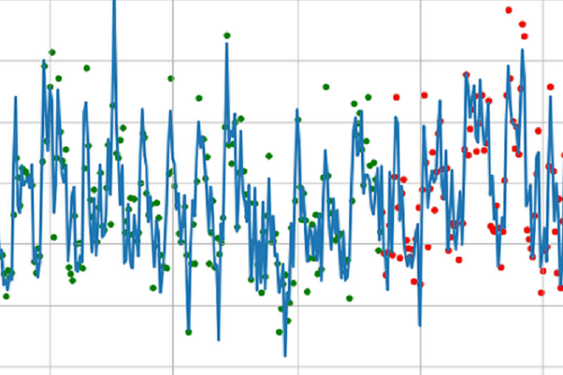

In the following, I provide an overview of the projects I was involved in related to data science and machine learning (ml). They will be subdivided into three major groups, which are the ml-projects I carried out as [data science professional](#data-science-professional-ml-projects), as [academic researcher](#academic-research-ml-projects) and as [free time developer](#free-time-developer-ml-projects).

&nbsp;

## **Data Science Professional ML-Projects**

| **Use Case** | **Project Goal** | **my Role** | **Skills & Tools** |
| ----------- | ----------- | ----------- | ----------- |
| ***Cerebral Disease Detection***  | *To identity pathological cerebral changes* | *As a data scientist, I developed explainable classification ml-models providing disease propensity scores based on labeled MRI volumetry datasets. In addition, I documented relevant scientific publications on this topic.* | *Magnetic Resonance Imaging, Image Analysis, Machine Learning, Data Preparation, Data Visualization, Explainable AI (shapley values), Python (numpy, pandas, sklearn, matplotlib, shap), Jupyter, Colab, VSCode, Gitlab* |
| **Use Case** | **Project Goal** | **my Role** | **Skills & Tools** |
| ***Purchase Analysis*** | *To identity incorrect order processes* | *As a data scientist, I developed a classification model from historical tabular data providing propensity scores for incorrect orders. I deployed and updated the model in SPSS modeler. In addition, I advised the specialist department on the benefits and pitfalls during use of the model.* | *Machine Learning, Data Preparation, Data Visualization, Natural Language Processing (bag-of-words), Python (numpy, pandas, sklearn, matplotlib), R, Jupyter, RStudio, Spyder, SPSS Modeler* |
| **Use Case** | **Project Goal** | **my Role** | **Skills & Tools** |
| ***Predictive Maintenance*** | *To predict machine-failure of wind turbines* | *As a data scientist, I developed a classification model based on weather and sensory time-series data providing propensity scores for imminent failure of wind turbines. In addition, I advised the specialist department on the benefits and pitfalls during use of the model.* | *Machine Learning, Data Preparation, Data Visualization, SPSS Modeler* |
| **Use Case** | **Project Goal** | **my Role** | **Skills & Tools** |
| ***Credit Default*** | *To predict upcoming payment defaults* | *As a data scientist, I developed a classification model based on tabular time-series data providing the propensity scores of upcoming payment defaults. In addition, I advised the specialist department on the benefits and pitfalls during use of the model.* | *Machine Learning, Deep Learning, Data Preparation, Data Visualization, Python (numpy, pandas, matplotlib, sklearn, keras), Jupyter, VSCode* |
| **Use Case** | **Project Goal** | **my Role** | **Skills & Tools** |
| ***Data Deduplication*** | *To remove duplicated rows from large datasets* | *As a data scientist, I developed a classification-clustering mixture model based on tabular data to detect duplicates of names and addresses. In addition, I supported the development team with building data-pipelines and the deployment of the model.* | *Machine Learning, Data Preparation, Data Visualization, Python (numpy, pandas, matplotlib, sklearn, dedupe), Jupyter, VSCode, git, SQL* |
| **Use Case** | **Project Goal** | **my Role** | **Skills & Tools** |
| ***Customer Value*** | *To improve customer value estimation* | *As a data scientist, I consulted the specialist department on how to improve an existing customer value model applying state-of-the-art machine learning methods. I further supported the data engineering team to continuously deploy new model versions.* | *Machine Learning, Data Preparation, Data Visualization, SPSS Modeler* |
| **Use Case** | **Project Goal** | **my Role** | **Skills & Tools** |
| ***Customer Churn*** | *To improve customer churn prediction* | *As a data scientist, I consulted the specialist department on how to improve the existing customer churn model applying state-of-the-art machine learning methods. I further supported the data engineering team to continuously deploy new model versions.* | *Machine Learning, Data Preparation, Data Visualization, SPSS Modeler* |
| **Use Case** | **Project Goal** | **my Role** | **Skills & Tools** |
| ***Customer Segmentation*** | *To improve customer segmentation* | *As a data scientist, I developed a new customer segmentation model with improved performance compared to the existing model. I further supported the data engineering team to continuously deploy new model versions.* | *Machine Learning, Data Preparation, Data Visualization, SPSS Modeler* |
| **Use Case** | **Project Goal** | **my Role** | **Skills & Tools** |
| ***Deal Completion Optimization*** | *To improve business deal completion rates* | *As a data scientist, I developed a classification model based on tabular data providing propensity scores for business deal completion that could be used for priorization purposes. In addition, I advised the specialist department on the benefits and pitfalls during use of the model.* | *Machine Learning, Data Preparation, Data Visualization, Python (numpy, pandas, matplotlib, sklearn), Jupyter* |
| **Use Case** | **Project Goal** | **my Role** | **Skills & Tools** |
| ***Price Optimization*** | *To optimize product prices* | *As a data scientist, I developed a classification model based on tabular data as a foundation for further product price optimization. In addition, I advised the specialist department on the benefits and pitfalls during use of the model.* | *Machine Learning, Data Preparation, Data Visualization, Python (numpy, pandas, matplotlib, sklearn, spacy), Jupyter, SPSS modeler* |
| **Use Case** | **Project Goal** | **my Role** | **Skills & Tools** |
| ***Price Forecasting*** | *To predict electricity market prices* | *As a data scientist, I developed a regression model based on historical time-series data to estimate the electricity market price for the next day. In addition, I advised the specialist department on the benefits and pitfalls during use of the model.* | *Machine Learning, Deep-Learning, Data Preparation, Data Visualization, Python (numpy, pandas, matplotlib, sklearn, keras), Jupyter, VSCode* |
| **Use Case** | **Project Goal** | **my Role** | **Skills & Tools** |
| ***Meter Forecasting*** | *To forecast meter-readings* | *As a data scientist, I developed a regression model based on historical time-series data to forecast meter-readings. In addition, I advised the specialist department on the benefits and pitfalls during use of the model.* | *Machine Learning, Deep-Learning, Data Preparation, Data Visualization, Python (numpy, pandas, matplotlib, sklearn, keras), Jupyter, VSCode* |

&nbsp;

# **Academic Research ML-Projects**

| **Use Case** | **Project Goal** | **my Role** | **Skills & Tools** |
| ----------- | ----------- | ----------- | ----------- |
| ***MRI-based OEF Mapping***  | *To improve mapping of the OEF (=oxygen extraction fraction)* | *As a post-doc researcher, I developed an artificial neural network regression model which significantly improved the quality of OEF maps, very important for assessing tissue vitality, tumor diagnosis or planing radio therapy. (More details are provided in: Domsch et al., Magnetic Resonance in Medicine, 79(2), pp.890-899, 2018)* | *Magnetic Resonance Imaging, Machine Learning, Artificial Neural Networks, Matlab* |
| **Use Case** | **Project Goal** | **my Role** | **Skills & Tools** |
| ***MRI-based Diffusion Imaging***  | *To improve mapping of diffusion parameters* | *As a post-doc researcher, I advised on the development of an artificial neural network regression model which significantly improved the quality of diffusion parameter maps, very important for assessing tissue vitality, tumor diagnosis or planing radio therapy. (More details are provided in: Domsch et al., NMR Biomed, 30(12), 2017)* | *Magnetic Resonance Imaging, Machine Learning, Artificial Neural Networks, Matlab* |

&nbsp;

## **Free Time Developer ML-Projects**

| **Use Case** | **Project Goal** | **Implementation** | **Skills & Tools** |
| ----------- | ----------- | ----------- | ----------- |
| ***Cardio Vascular Disease***  <small><small>*Image courtesy: guardian.ng*</small> | *To predict cardio vascular disease* | *In my free time I implemented a classification model, trained on tabular data, providing disease risk propensity scores. I deployed the model as an endpoint in aws-sagemaker. (The code and more details are provided in my github.)* | *Machine Learning, Data Preparation, Data Visualization, Python (numpy, pandas, sklearn, matplotlib, seaborn, sagemaker, boto3), Sagemaker Studio* |
| **Use Case** | **Project Goal** | **Implementation** | **Skills & Tools** |
| ***Topic Modeling***  | *To extract topics from documents* | *In my free time I implemented a natural language processing model using the latent-dirichlet-allocation algorithm and trained on raw text data to extract topics from articles. I deployed the model with flask-api as backend. (The code and more details are provided in my github.)* | *Natural Language Processing, Machine Learning, Data Preparation, Data Visualization, Python (numpy, pandas, sklearn, matplotlib, nltk, flask), VSCode, Jupyter* |
| **Use Case** | **Project Goal** | **Implementation** | **Skills & Tools** |
| ***Object Detection***  | *To detect fruits on images* | *In my free time I implemented a fruit detection model, trained on image data, using Azure cognitive services. (The code and more details are provided in my github.)* | *Image Processing, Machine Learning, Data Preparation, Data Visualization, Python (numpy, pandas, sklearn, matplotlib, pil), VSCode, Jupyter, Azure Cognitive Services* |
| **Use Case** | **Project Goal** | **Implementation** | **Skills & Tools** |
| ***Text Analysis***  <small><small>*Image courtesy: thedatascientist.com*</small>  | *To recognize text* | *In my free time I implemented a language recognition model, trained on raw text, using Azure cognitive services to identify language, extract keywords and entities and analyse sentiments from hotel reviews. (The code and more details are provided in my github.)* | *Natural Language Processing, Machine Learning, Data Preparation, Python (numpy, pandas, sklearn, matplotlib), VSCode, Jupyter Notebook, Azure Cognitive Services* |
| **Use Case** | **Project Goal** | **Implementation** | **Skills & Tools** |
| ***Credit Default***  <small><small>*Image courtesy: kindpng.com*</small> | *To predict credit default risks* | *In my free time I implemented a classification model, trained on tabular data, to predict credit default risks. I deployed the model in docker with streamlit for both backend and frontend. (The code and more details are provided in my github.)* | *Machine Learning, Data Preparation, Python (numpy, pandas, matplotlib, sklearn, shap, streamlit, docker), Jupyter, VSCode* |
| **Use Case** | **Project Goal** | **Implementation** | **Skills & Tools** |
| ***Diabetis Risk***  <small><small>*Image courtesy: aok-erleben.de*</small> | *To predict diabetis risks* | *In my free time I implemented an explainable classification model, trained on tabular data, to predict diabetis risks. Thereby, the scoring function was customized to meet business criteria (e.g. a false negative prediction leads to higher costs than a false positive prediction). I deployed the model in docker with a flask-api backend. (The code and more details are provided in my github.)* | *Explainable AI, Fair AI, Machine Learning, Data Preparation, Data Visualization, Python (numpy, pandas, matplotlib, sklearn, shap, fair-learn, docker), Jupyter, VSCode* |
| **Use Case** | **Project Goal** | **Implementation** | **Skills & Tools** |
| ***Customer Churn***  | *To predict customer churn* | *In my free time I implemented an explainable classification model, trained on tabular data, to predict customer churn risks using auto-machine-learning. Thereby, the scoring function was customized to meet business criteria (e.g. a false negative prediction leads to higher costs than a false positive prediction). I deployed the model in docker with a fast-api backend. (The code and more details are provided in my github.)* | *Automated Machine-Learning, Explainable AI, Fair AI, Data Preparation, Data Visualization, Python (numpy, pandas, pycaret, fastapi, docker), Jupyter, VSCode* |
| **Use Case** | **Project Goal** | **Implementation** | **Skills & Tools** |
| ***Customer Value***  | *To predict customer lifetime values* | *In my free time I implemented an explainable and fair regression model, trained on tabular data, to predict customer lifetime values.(The code and more details are provided in my github.)* | *Explainable AI, Fair AI, Machine Learning, Data Preparation, Data Visualization, Python (numpy, pandas, matplotlib, sklearn, shap, fairlearn), Jupyter, VSCode* |
| **Use Case** | **Project Goal** | **Implementation** | **Skills & Tools** |
| ***Sales Forecasting***  | *To forecast sales and identify driving features* | *In my free time I compared different modeling approaches forecasting sales using explainable models (i.e. classical ml-models in combination with shapley-values and the novel neural-prophet algorithm by facebook) to identify driving features.(The code and more details are provided in my github.)* | *Explainable AI, Machine Learning, Data Preparation, Data Visualization, Python (numpy, pandas, matplotlib, sklearn, shap, neural-prophet), Jupyter, VSCode* |

