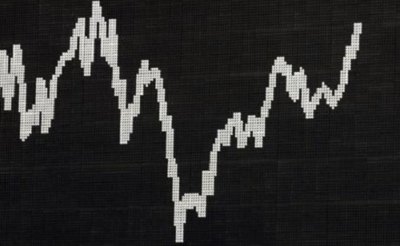

In the following, you´ll find an overview of my project experiences in healthcare and the renewable energy industry. They are subdivided into two major groups. In group one you´ll find a brief description of the the machine learning projects I carried out as a [data science professional](#data-science-professional-projects-on-machine-learning-and-optimization). In the second group you´ll find a brief description of the the projects related to machine learning and optimization I carried out as an [academic researcher](#academic-research-projects-on-machine-learning-and-optimization). Last but not least, I put together some [side-hustle-projects](#side-hustle-projects-on-machine-learning-and-optimization) I implemented in my spare time just for fun, curiosity or my eagerness to expand my knowlede in the field of machine learning and optimization.

# **Data Science Professional Projects on Machine Learning and Optimization**
### **Healthcare Projects:**

| **Use Case** | **Project Goal** | **my Role** | **Skills & Tools** |
| ----------- | ----------- | ----------- | ----------- |
| ***Cerebral Disease Detection***  | *To identity pathological cerebral changes* | *I developed explainable classification ml-models providing disease propensity scores based on labeled MRI volumetry datasets. In addition, I documented relevant scientific publications on this topic.* | *Magnetic Resonance Imaging, Image Analysis, Machine Learning, Data Preparation, Data Visualization, Explainable AI (shapley values), Python (numpy, pandas, sklearn, matplotlib, shap), Jupyter, Colab, VSCode, Gitlab* |

### **Renewable Energy Projects:**

| **Use Case** | **Project Goal** | **my Role** | **Skills & Tools** |
| ----------- | ----------- | ----------- | ----------- |
| ***Purchase Analysis*** | *To identity incorrect order processes* | *I developed a classification model from historical tabular data providing propensity scores for incorrect orders. I deployed and updated the model in SPSS modeler. In addition, I advised the specialist department on the benefits and pitfalls during use of the model.* | *Machine Learning, Data Preparation, Data Visualization, Natural Language Processing (bag-of-words), Python (numpy, pandas, sklearn, matplotlib), R, Jupyter, RStudio, Spyder, SPSS Modeler* |
| **Use Case** | **Project Goal** | **my Role** | **Skills & Tools** |
| ***Predictive Maintenance*** | *To predict machine-failure of wind turbines* | *I developed a classification model based on weather and sensory time-series data providing propensity scores for imminent failure of wind turbines. In addition, I advised the specialist department on the benefits and pitfalls during use of the model.* | *Machine Learning, Data Preparation, Data Visualization, SPSS Modeler* |
| **Use Case** | **Project Goal** | **my Role** | **Skills & Tools** |
| ***Credit Default*** | *To predict upcoming payment defaults* | *I developed a classification model based on tabular time-series data providing the propensity scores of upcoming payment defaults. In addition, I advised the specialist department on the benefits and pitfalls during use of the model.* | *Machine Learning, Deep Learning, Data Preparation, Data Visualization, Python (numpy, pandas, matplotlib, sklearn, keras), Jupyter, VSCode* |
| **Use Case** | **Project Goal** | **my Role** | **Skills & Tools** |
| ***Data Deduplication*** | *To remove duplicated rows from large datasets* | *I developed a classification-clustering mixture model based on tabular data to detect duplicates of names and addresses. In addition, I supported the development team with building data-pipelines and the deployment of the model.* | *Machine Learning, Data Preparation, Data Visualization, Python (numpy, pandas, matplotlib, sklearn, dedupe), Jupyter, VSCode, git, SQL* |
| **Use Case** | **Project Goal** | **my Role** | **Skills & Tools** |
| ***Customer Value*** | *To improve customer value estimation* | *I consulted the specialist department on how to improve an existing customer value model applying state-of-the-art machine learning methods. I further supported the data engineering team to continuously deploy new model versions.* | *Machine Learning, Data Preparation, Data Visualization, SPSS Modeler* |
| **Use Case** | **Project Goal** | **my Role** | **Skills & Tools** |
| ***Customer Churn*** | *To improve customer churn prediction* | *I consulted the specialist department on how to improve the existing customer churn model applying state-of-the-art machine learning methods. I further supported the data engineering team to continuously deploy new model versions.* | *Machine Learning, Data Preparation, Data Visualization, SPSS Modeler* |
| **Use Case** | **Project Goal** | **my Role** | **Skills & Tools** |
| ***Customer Segmentation*** | *To improve customer segmentation* | *I developed a new customer segmentation model with improved performance compared to the existing model. I further supported the data engineering team to continuously deploy new model versions.* | *Machine Learning, Data Preparation, Data Visualization, SPSS Modeler* |
| **Use Case** | **Project Goal** | **my Role** | **Skills & Tools** |
| ***Deal Completion Optimization*** | *To improve business deal completion rates* | *I developed a classification model based on tabular data providing propensity scores for business deal completion that could be used for priorization purposes. In addition, I advised the specialist department on the benefits and pitfalls during use of the model.* | *Machine Learning, Data Preparation, Data Visualization, Python (numpy, pandas, matplotlib, sklearn), Jupyter* |
| **Use Case** | **Project Goal** | **my Role** | **Skills & Tools** |
| ***Price Optimization*** | *To optimize product prices* | *I developed a classification model based on tabular data as a foundation for further product price optimization. In addition, I advised the specialist department on the benefits and pitfalls during use of the model.* | *Machine Learning, Data Preparation, Data Visualization, Python (numpy, pandas, matplotlib, sklearn, spacy), Jupyter, SPSS modeler* |
| **Use Case** | **Project Goal** | **my Role** | **Skills & Tools** |
| ***Price Forecasting*** | *To predict electricity market prices* | *I developed a regression model based on historical time-series data to estimate the electricity market price for the next day. In addition, I advised the specialist department on the benefits and pitfalls during use of the model.* | *Machine Learning, Deep-Learning, Data Preparation, Data Visualization, Python (numpy, pandas, matplotlib, sklearn, keras), Jupyter, VSCode* |
| **Use Case** | **Project Goal** | **my Role** | **Skills & Tools** |
| ***Meter Forecasting*** | *To forecast meter-readings* | *I developed a regression model based on historical time-series data to forecast meter-readings. In addition, I advised the specialist department on the benefits and pitfalls during use of the model.* | *Machine Learning, Deep-Learning, Data Preparation, Data Visualization, Python (numpy, pandas, matplotlib, sklearn, keras), Jupyter, VSCode* |

[Top of Page](#data-science-professional-projects-on-machine-learning-and-optimization)

&nbsp;

# **Academic Research Projects on Machine Learning and Optimization**

| **Use Case** | **Project Goal** | **my Role** | **Skills & Tools** |
| ----------- | ----------- | ----------- | ----------- |
| ***MRI-based OEF Mapping***  | *To improving mapping of the OEF (=oxygen extraction fraction) with artificlial neural networks* | *I developed an artificial neural network regression model to improve the quality of OEF maps, very important for assessing tissue vitality, tumor diagnosis or planing radio therapy. (More details are provided in: Domsch et al., Magnetic Resonance in Medicine, 79(2), pp.890-899, 2018)* | *Magnetic Resonance Imaging, Machine Learning, Artificial Neural Networks, Matlab* |
| ***MRI-based OEF Mapping***  | *To improve mapping of the OEF (=oxygen extraction fraction) with regularized regression* | *I developed a regularized regression model to improve the quality of OEF maps, very important for assessing tissue vitality, tumor diagnosis or planing radio therapy. Further, I advised other colleagues on the development of this data modeling strategy. (More details are provided in: Domsch et al., Proc. ESMRMB Congress, Edinburgh, UK, 32, p.36, 2015); S. Thomas, S. Hubertus, S. Domsch and L. Schad, Proc. Int. Soc. Magn. Reson. Med., Paris, France, 26, p.2093, 2018* | *Magnetic Resonance Imaging, Machine Learning, Artificial Neural Networks, Matlab* |
| **Use Case** | **Project Goal** | **my Role** | **Skills & Tools** |
| ***MRI-based Diffusion Imaging***  | *To research on improving the mapping of diffusion parameters with artificlial neural networks* | *I advised other colleagues on the development of an artificial neural network regression model to improve the quality of diffusion parameter maps, very important for assessing tissue vitality, tumor diagnosis or planing radio therapy. (More details are provided in: Domsch and Bertleff et al., NMR Biomed, 30(12), 2017)* | *Magnetic Resonance Imaging, Machine Learning, Artificial Neural Networks, Matlab* |

[Top of Page](#data-science-professional-projects-on-machine-learning-and-optimization)

&nbsp;

# **Side-Hustle Projects on Machine Learning and Optimization**

Below you find a brief overview of some sample projects I implemented in my spare time just for fun, curiosity or my eagerness to expand my knowlede in the field of machine learning and optimization. Please check out my [github](https://github.com/Sebastian1981/) for more interesting coding-projects on topics such as customer life time value prediction, churn prediction, sales forecast, diabetis risk prediction, natural language processing or object detection.

&nbsp;

### **------------------------------------- Finance -------------------------------------**

| **Use Case** | **Project Goal** | **Implementation** | **Skills & Tools** |
| ----------- | ----------- | ----------- | ----------- |
| ***Asset-Portfolio Optimization***  | *To implement a portfolio optimization web-app* | *I implemented a  finance portfolio optimization app to maximize the expected return for a given risk using monte-carlo simulations, genetic algorithms and artificial swarm intelligence. The app was deployed in the [streamlit-cloud](https://portfoliooptimization.streamlitapp.com). (More details are provided in my [github](https://github.com/Sebastian1981/Stock_Prediction))* | *Monte-Carlo Simulation, Machine Learning, Genetic Algorithms, Artificial Swarm Intelligence, Python (numpy, pandas, matplotlib, sklearn, shap, streamlit,geneticalgorithm, pyswarm), Jupyter, VSCode* |

| **Use Case** | **Project Goal** | **Implementation** | **Skills & Tools** |
| ----------- | ----------- | ----------- | ----------- |
| ***Credit Default Prediction***  <small><small>*Image courtesy: kindpng.com*</small> | *To implement a credit default prediction web-app* | *I implemented a classification model to predict credit default risks. Then I developed a streamlit web-app, which I deployed as an [azure web-app](https://creditdefaultapp.azurewebsites.net). (More details are provided in my [github](https://github.com/Sebastian1981/CustomerAnalytics_CreditDefaultPrediction))* | *Machine Learning, Python (numpy, pandas, matplotlib, sklearn, shap, streamlit), Jupyter, VSCode, docker, azure container registry, azure app service* |

&nbsp;

### **------------------------------------- Healthcare -------------------------------------**

| **Use Case** | **Project Goal** | **Implementation** | **Skills & Tools** |
| ----------- | ----------- | ----------- | ----------- |
| ***COVID-19 Prediction***  <small><small>*Image courtesy: ndr.de*</small> | *To implement a web-app for predicting COVID-19 patients in ICU* | *I implemented a time-series regression model on public covid datasets provided by www.ourworldindata.org to predict the number of COVID-19 patients in ICU (=intensive care units) for different countries worldwide in real-time. Then I developed a streamlit app, which I deployed in [streamlit-cloud](https://sebastian1981-covid-prediction-streamlit-appapp-i8x7ho.streamlitapp.com) and as an [azure web-app](https://covid19app.azurewebsites.net). (More details are provided in my [github](https://github.com/Sebastian1981/covid_prediction))* | *Auto-ML, Python (numpy, pandas, matplotlib, pycaret, streamlit), Jupyter, VSCode, docker, azure container registry, azure app service* |
| **Use Case** | **Project Goal** | **Implementation** | **Skills & Tools** |
| ***Insurance Bill Prediction***  | *To implement both a web-app and web-api to predict insurance bills* | *I implemented a regression model to predict insurance bills based on user input. Then I developed both a streamlit-app and also a flask-api, which were deployed as an [azure web-app](https://insurancebillapp.azurewebsites.net) and an [azure web-api](https://insurancebillapi.azurewebsites.net). (More details are provided in my [github](https://github.com/Sebastian1981/Insurance_Bill_Prediction))* | *Machine Learning, Python (numpy, pandas, matplotlib, sklearn, streamlit, flask-api), Jupyter, VSCode, docker, azure container registry, azure app service* |

&nbsp;

### **------------------------------------- Natural Language Processing -------------------------------------**

| **Use Case** | **Project Goal** | **Implementation** | **Skills & Tools** |
| ----------- | ----------- | ----------- | ----------- |
| ***NLP - Text Recognition***  <small><small>*Image courtesy: thedatascientist.com*</small>  | *To implement a text recognizer in Azure* | *I implemented a language recognition model, trained on raw text, using Azure cognitive services to identify language, extract keywords and entities and analyse sentiments from hotel reviews. (The code and more details are provided in the [github repo](https://github.com/Sebastian1981/Text_Analysis))* | *Natural Language Processing, Machine Learning, Data Preparation, Python (numpy, pandas, sklearn, matplotlib), VSCode, Jupyter Notebook, Azure Cognitive Services* |

&nbsp;

### **----------------------------------Image Analysis ----------------------------------**

| **Use Case** | **Project Goal** | **Implementation** | **Skills & Tools** |
| ----------- | ----------- | ----------- | ----------- |
| ***Object Detection***  | *To implement a fruit detector in Azure* | *I implemented a fruit detection model, trained on image data, using Azure cognitive services. (The code and more details are provided in the [github repo](https://github.com/Sebastian1981/Object_Detection))* | *Image Processing, Machine Learning, Data Preparation, Data Visualization, Python (numpy, pandas, sklearn, matplotlib, pil), VSCode, Jupyter, Azure Cognitive Services* |

[Top of Page](#data-science-professional-projects-on-machine-learning-and-optimization)